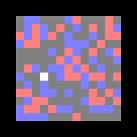
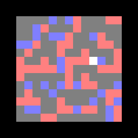
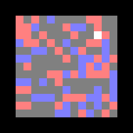
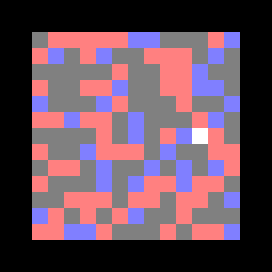

# Deep_Reinforcement_Learning_Mini_Project

Project from the Deep Learning course of the MVA master (ENS Paris Saclay) taught by Vincent Lepetit.

The goal of this project was to create an environment where a mouse had to learn how to find bits of cheese (red) and avoid poison (blue).

**Random approach :**

**Fully connected Layer :**

**Convolutional Neural Network :**

**Fine tuned model :**

